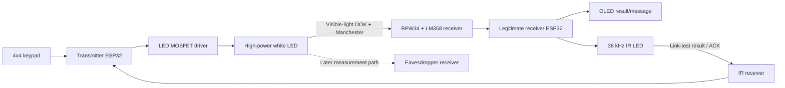

# Li-Fi Communication and Security Demonstrator

## Technical Design and Project Status

**Document date:** 18 August 2026  
**Implementation platform:** ESP32 DevKit V1, Arduino framework, PlatformIO  
**Project stage:** Legitimate transmitter/receiver proof-of-concept; hardware
bring-up and simplified operating modes are the next milestone

## 1. Executive summary

The project demonstrates short-range digital communication through visible
light and studies the practical security boundary of that link. A transmitter
modulates a high-power white LED, a legitimate receiver recovers the data with
a photodiode circuit, and a later eavesdropper node attempts to recover the same
data from unintended locations.

The first software proof-of-concept is present and builds successfully. It can:

- accept a short message from a 4x4 keypad or Serial Monitor;
- encode it into a structured frame;
- transmit the frame through the white LED using on-off keying and Manchester
  line coding;
- sample the photodiode amplifier through the receiver ESP32 ADC;
- validate a received frame with CRC-8;
- display a valid payload on the OLED; and
- return a 38 kHz IR acknowledgment to the transmitter.

This code has not yet been proven on the assembled PCBs. It also performs a
calibration preamble and acknowledgment for every message, which is more
complex than needed for the first demonstration. The agreed next revision will
separate an on-demand link test from normal message transmission:

- `A`: run a known-sequence link test, measure quality, show the result, and
  return an IR response;
- `B`: enter normal message mode and send short messages using the most recent
  link calibration.

The eavesdropper work will begin only after this basic legitimate link is
repeatable.

## 2. Project purpose and scope

### 2.1 Primary objectives

1. Establish a repeatable one-way visible-light data link between two ESP32
   systems.
2. Provide a simple keypad-operated demonstration that is easy to understand.
3. Measure legitimate link quality using a known test sequence.
4. Build a third receiving node and compare its recovery performance against
   the legitimate receiver.
5. Record how geometry and environment affect both communication reliability
   and exposure to eavesdropping.

### 2.2 Initial deliverable

The initial deliverable is a laboratory demonstrator, not a high-speed Li-Fi
network. It prioritizes observable operation, simple debugging, and repeatable
measurements over data rate.

### 2.3 Items outside the current implementation

- encryption and cryptographic authentication;
- high-speed data transfer;
- automatic detection of every passive optical eavesdropper;
- production-grade error correction;
- automatic gain control in the analog receiver;
- completed eavesdropper firmware and hardware validation.

These can be evaluated after the base optical link is stable.

## 3. System architecture



The main data path is visible light from transmitter to receiver. The return
path is infrared and is intended only for a short status response. The
transmitter does not contain a visible-light photodiode, so the optical data
path itself is one-way.

## 4. Hardware interfaces and exact ESP32 pins

The following assignments were taken from the supplied `Job1.PDF` transmitter
and `Job2.PDF` receiver schematics and are centralized in
`include/pin_config.hpp`.

### 4.1 Transmitter

| Circuit function | ESP32 signal | GPIO | Firmware direction |
|---|---|---:|---|
| White LED MOSFET gate | `LED_GATE` | 18 | Output |
| Red warning/status LED | `WARNING_LED` | 23 | Output |
| IR receiver signal | `IR_ACK` | 19 | Input |
| Keypad row 1 | `KEY_R1` | 13 | Matrix I/O |
| Keypad row 2 | `KEY_R2` | 14 | Matrix I/O |
| Keypad row 3 | `KEY_R3` | 27 | Matrix I/O |
| Keypad row 4 | `KEY_R4` | 26 | Matrix I/O |
| Keypad column 1 | `KEY_C1` | 25 | Matrix I/O |
| Keypad column 2 | `KEY_C2` | 33 | Matrix I/O |
| Keypad column 3 | `KEY_C3` | 32 | Matrix I/O |
| Keypad column 4 | `KEY_C4` | 16 | Matrix I/O |

The ESP32 controls the LED indirectly through the MOSFET gate. The software
sets GPIO18 LOW during startup so the optical LED remains off until an explicit
transmission or test.

### 4.2 Legitimate receiver

| Circuit function | ESP32 signal | GPIO | Firmware direction |
|---|---|---:|---|
| BPW34/LM358 analog signal | `LIFI_ADC` | 34 | ADC input |
| IR LED driver | `IR_TX` | 18 | PWM output |
| OLED data | `OLED_SDA` | 21 | I2C |
| OLED clock | `OLED_SCL` | 22 | I2C |

GPIO34 is input-only on the ESP32 and is suitable for the ADC signal. The
firmware currently configures a 12-bit ADC reading and 11 dB attenuation. The
actual usable range, noise, polarity, and saturation point must be measured on
the physical PCB.

### 4.3 Hardware boundary

Firmware determines when the MOSFET is switched, but it does not set or safely
limit the high-power LED current. LED current and heat are governed by the
external supply, LED forward voltage, series/current-control component,
MOSFET, PCB traces, and thermal design. Those values must be verified before a
continuous LED test. Short test pulses should be used during initial bring-up.

## 5. Software organization

The project uses PlatformIO so each ESP32 role can be built independently from
one repository.

| Environment | Source | Purpose | Present status |
|---|---|---|---|
| `transmitter` | `src/transmitter/main.cpp` | Keypad input and optical transmission | Builds |
| `receiver` | `src/receiver/main.cpp` | ADC decoding, OLED, and IR ACK | Builds |
| `eavesdropper` | `src/eavesdropper/main.cpp` | Later passive receiver experiment | Placeholder |

Shared protocol timing, frame limits, and CRC are in
`include/lifi_protocol.hpp`. Shared pin assignments are in
`include/pin_config.hpp`.

The next revision should add two separate diagnostic environments before the
main application is changed:

| Proposed environment | Purpose |
|---|---|
| `tx_diagnostic` | Verify keypad, warning LED, optical LED pulses, and IR input separately |
| `rx_diagnostic` | Verify ADC levels/noise, OLED, and a manually requested IR burst separately |

This lets each PCB function be proven without depending on the complete
communications protocol.

## 6. Modulation and line coding

### 6.1 Optical modulation: on-off keying

The project uses **intensity modulation with direct detection**. At the
firmware level this is on-off keying (OOK):

- MOSFET enabled: optical LED is ON;
- MOSFET disabled: optical LED is OFF;
- the photodiode/amplifier converts received optical intensity into an ADC
  level.

Only intensity is varied; the light does not use radio-frequency phase or
frequency modulation.

### 6.2 Line coding: Manchester

The raw OOK states are arranged as Manchester-coded bits. Every data bit has
two equal halves with a transition in the middle:

| Logical bit | First half | Second half |
|---:|---|---|
| `1` | Light ON | Light OFF |
| `0` | Light OFF | Light ON |

With the current constants, one optical half-symbol lasts 10 ms, giving 100
optical half-symbols per second. One complete Manchester data bit lasts 20 ms,
so the logical data-bit rate is:

```text
1 / 0.020 seconds = 50 bits per second
```

The useful payload rate is lower because every packet also carries
synchronization, header, and CRC data. At the current timing, a one-character
frame takes about 0.92 seconds and a maximum 16-character frame takes about
3.32 seconds, before the ACK wait. This slow initial setting is deliberate: it
gives the ESP32 ADC and analog front-end a generous sampling window during
bring-up. It can be increased only after oscilloscope/ADC measurements show
adequate settling and noise margin.

Manchester coding was chosen because:

- every bit contains a transition, making timing easier to observe;
- long runs of constant light or darkness cannot occur inside encoded data;
- each bit contains both an ON and OFF interval, reducing dependence on the
  absolute DC light level;
- invalid same-level pairs can be rejected immediately.

The cost is twice as many optical intervals as simple non-return-to-zero OOK.

### 6.3 Current frame format

The current proof-of-concept sends the following sequence for every message:

```text
60 ms dark idle
60 ms light sync
40 ms dark calibration
Manchester data bytes
20 ms dark guard
```

The Manchester data bytes are:

| Order | Field | Size | Purpose |
|---:|---|---:|---|
| 1 | Magic | 1 byte | Fixed `0xD3` frame identifier |
| 2 | Sequence | 1 byte | Distinguishes a new frame from a duplicate |
| 3 | Length | 1 byte | Payload length from 1 to 16 bytes |
| 4 | Payload | 1-16 bytes | Keypad/Serial message |
| 5 | CRC-8 | 1 byte | Detects accidental frame errors |

Bits are sent most-significant bit first. CRC-8 uses polynomial `0x07`, an
initial value of zero, and covers the magic, sequence, length, and payload.

### 6.4 Current receiver decision process

The receiver continuously learns an idle ADC level. A sufficiently large
change starts preamble detection. It then samples the known bright and dark
parts of the preamble and classifies later samples by whichever reference they
are closest to.

For each Manchester bit the receiver samples both halves:

- light then dark is decoded as `1`;
- dark then light is decoded as `0`;
- two equal classifications are rejected as an invalid Manchester symbol.

The receiver accepts a message only if the magic, length, Manchester symbols,
and CRC are valid.

### 6.5 IR return path

The receiver currently generates three short bursts of approximately 38 kHz
IR after a valid frame. A demodulating IR receiver on the transmitter reports
the burst as an active-low input. The transmitter waits up to 700 ms and lights
its warning LED if no response is seen.

This is a reliability acknowledgment. It is not proof of receiver identity and
not proof that an eavesdropper was absent.

## 7. Simplified target operating modes

The first code is intentionally being simplified before hardware trials. The
target design separates expensive training from normal user messages.

### 7.1 Idle state

At startup:

- optical LED is OFF;
- warning/status LED is OFF;
- transmitter waits for a mode key;
- receiver monitors its ADC and waits for either a link-test or message marker.

### 7.2 `A` — on-demand link test and calibration

Pressing `A` will start a deliberate handshake:

1. The transmitter sends a long, known ON/OFF training pattern.
2. The receiver measures the bright level, dark level, and noise.
3. The transmitter sends a known bit sequence, for example repeated `0x55` and
   `0xAA` bytes.
4. The receiver compares every decoded bit with the expected bit.
5. The receiver calculates an optical SNR estimate and bit success rate.
6. The OLED shows the result and a simple `OK`, `MARGINAL`, or `FAIL` state.
7. The receiver sends a short IR result/ACK.
8. Only while waiting for this result does the transmitter treat its IR input
   as part of the application workflow.
9. If the test passes, the measured bright/dark threshold is cached for later
   normal messages.

This handshake is user-controlled. It should be repeated after changing
distance, alignment, room lighting, receiver gain, or LED power.

### 7.3 `B` — normal message mode

Pressing `B` will enter message entry:

- keypad characters are appended to a short buffer;
- `*` removes the last character;
- `#` sends the message;
- `B` can cancel/exit message entry if desired in the final UI;
- the receiver displays a message only after a valid CRC.

A normal message still requires a **short start marker** so that an idle
receiver knows where the first bit begins. It will retain length and CRC
framing, but it will not repeat the full bright/dark training sequence and will
not require an IR ACK for every message. It will use the calibration cached by
the most recent successful `A` link test.

This is the simplest practical separation: full measurement when requested,
minimal framing during normal communication.

## 8. Link-quality measurements

### 8.1 Optical SNR estimate

During the known training intervals, the receiver can collect multiple ADC
samples for ON and OFF states. Let:

- `mean_on` be the average ADC value during known light-ON intervals;
- `mean_off` be the average ADC value during known light-OFF intervals;
- `sigma_on` and `sigma_off` be their standard deviations.

A practical pooled noise estimate is:

```text
noise = sqrt((sigma_on^2 + sigma_off^2) / 2)
signal_separation = abs(mean_on - mean_off)
SNR_dB = 20 * log10(signal_separation / noise)
```

This is an ADC-domain optical quality estimate for this demonstrator. It should
not be represented as a calibrated RF-style SNR measurement unless the analog
front-end and measurement method are independently calibrated.

ADC clipping also needs to be checked. A large apparent separation is not
useful if the amplifier is saturating at either rail.

### 8.2 Known-sequence success rate and BER

If `N` known test bits are sent and `errors` bits differ from the expected
sequence:

```text
BER = errors / N
success_percent = 100 * (N - errors) / N
```

Both should be displayed or logged. A frame-level pass alone is not enough for
experimentation because it hides how close the link is to failure.

### 8.3 Initial provisional categories

The following values are starting points for laboratory tuning, not final
specifications:

| State | Proposed initial rule |
|---|---|
| `OK` | SNR at least 10 dB and success at least 95% |
| `MARGINAL` | SNR at least 6 dB and success at least 80% |
| `FAIL` | Below either marginal threshold or no valid response |

Final thresholds should be selected from collected test data, especially data
near the distance and angle where messages begin to fail.

## 9. Security work and claims

### 9.1 Threat model for the demonstrator

The main research question is whether a passive receiver outside the intended
optical path can recover transmitted data. Relevant variables include:

- transmitter-to-receiver distance;
- direct alignment and viewing angle;
- LED beam spread and reflections from walls/surfaces;
- obstruction of the direct path;
- ambient sunlight or artificial light;
- receiver gain, field of view, and physical shielding;
- eavesdropper location relative to the legitimate receiver.

Later experiments may also discuss active optical injection, replay, or a
forged IR response, but these are separate threats from passive listening.

### 9.2 What the current design provides

| Mechanism | Actual benefit | Security limitation |
|---|---|---|
| Directional visible-light path | Can limit where a strong signal is available | Reflections and wider beam paths can leak data |
| Manchester validity checks | Reject malformed optical symbols | Not authentication |
| CRC-8 | Detects many accidental bit errors | An attacker can recompute it; not cryptographic integrity |
| Sequence byte | Suppresses an immediate duplicate in the current receiver | Wraps after 256 and does not prevent deliberate replay |
| IR acknowledgment | Confirms that some expected IR activity was observed | Can be blocked, copied, or forged; does not identify a receiver |
| Warning LED | Shows link/ACK failure in the current prototype | Does not detect a silent passive eavesdropper |

### 9.3 What must not be claimed

The project should not claim that visible light alone guarantees secrecy. An
eavesdropper may capture direct spill light or reflected light. The current
payload is plaintext. Anyone who can observe and decode the modulation can read
it.

The current design also cannot automatically detect a purely passive
eavesdropper. A passive device does not need to transmit anything, so its
presence creates no guaranteed signal at the legitimate nodes.

### 9.4 Planned security experiment

After the legitimate link is stable, the third ESP32 receiver should implement
the same raw optical sampling and decoder without participating in the IR
handshake. Tests should transmit the same known sequence to both receivers and
record:

- legitimate receiver ADC ON/OFF means, noise, SNR estimate, BER, and valid
  frame count;
- eavesdropper ADC ON/OFF means, noise, SNR estimate, BER, and valid frame
  count;
- distance, angle, offset, obstruction, room-light condition, and receiver
  configuration.

The useful result is a measured spatial boundary:

- region where the legitimate receiver is reliable;
- region where an eavesdropper can also decode reliably;
- region where energy is observable but data cannot be recovered;
- region where neither receiver can decode.

This provides an evidence-based security assessment instead of assuming that
line-of-sight automatically means confidentiality.

### 9.5 Optional later cryptographic layer

If confidential data must be transmitted, physical directionality
should be supplemented with authenticated encryption and managed keys. A
challenge-response handshake can also authenticate the legitimate receiver.
These mechanisms are deliberately not presented as implemented in the current
project and should be separately specified before development.

## 10. Verification strategy

### Phase 1 — software-only checks

- build every PlatformIO environment;
- verify frame construction and CRC with known test vectors;
- verify mode-state behavior through Serial Monitor;
- confirm LED outputs default to OFF.

### Phase 2 — transmitter diagnostic firmware

- identify every keypad key and verify the row/column mapping;
- pulse the status LED;
- pulse the optical LED briefly at a safe hardware current;
- display raw IR input changes in Serial Monitor;
- verify that no output remains unintentionally active after reset.

### Phase 3 — receiver diagnostic firmware

- confirm OLED address, startup, and text output;
- stream ADC mean, minimum, maximum, and noise with the LED OFF;
- repeat with known LED ON/OFF states;
- check amplifier polarity and ADC saturation;
- manually transmit a 38 kHz IR burst and verify it at the transmitter.

### Phase 4 — `A` link test

- send the known optical training sequence;
- calculate and display SNR, errors, and success rate;
- return IR pass/fail status;
- tune timing and provisional thresholds from measured data.

### Phase 5 — `B` normal messages

- enter, edit, cancel, and send keypad messages;
- confirm a short start marker is detected reliably using cached calibration;
- reject bad Manchester symbols, invalid length, and bad CRC;
- verify behavior after lighting/alignment changes and a new `A` test.

### Phase 6 — eavesdropper experiment

- implement passive capture without an ACK;
- run a defined position/angle/distance matrix;
- export consistent logs from both receivers;
- analyze legitimate reliability against unintended recoverability.

## 11. Acceptance criteria for the first demonstration

The first milestone can be considered complete when:

1. Both diagnostic firmwares verify every connected peripheral.
2. Pressing `A` produces a repeatable OLED link-quality result and an IR result
   at the transmitter.
3. Pressing `B`, entering a short message, and pressing `#` displays the same
   message at the legitimate receiver.
4. Invalid or corrupted frames are not displayed as valid messages.
5. Ten consecutive link tests at the agreed demonstration distance meet the
   selected success threshold under the selected lighting condition.
6. Timing, LED configuration, receiver gain, distance, and ambient conditions
   are recorded so the demonstration can be reproduced.

The eavesdropper investigation is a later milestone and should not block this
initial legitimate-link acceptance.

## 12. Current progress and next actions

### Completed in the repository

- PlatformIO project configured for ESP32 DevKit V1 and Arduino framework.
- Schematic-derived transmitter and receiver pin map added.
- Keypad/Serial message buffer implemented.
- OOK Manchester encoder implemented.
- Bright/dark preamble and ADC Manchester decoder implemented.
- Magic, sequence, length, payload, and CRC-8 framing implemented.
- OLED display and IR acknowledgment implemented.
- Transmitter and receiver environments compiled successfully.
- Eavesdropper environment reserved with a placeholder.

### Not yet completed

- firmware upload and physical PCB testing;
- separate transmitter and receiver diagnostic builds;
- `A` link-test state and quality calculation;
- `B` normal-message state with cached calibration;
- removal of full training and ACK from every normal message;
- measurement-driven timing/threshold tuning;
- eavesdropper implementation and controlled security trials.

### Recommended immediate sequence

1. Add and build `tx_diagnostic` and `rx_diagnostic` environments.
2. Test the two PCBs one peripheral at a time.
3. Record actual ADC ON/OFF/noise values and confirm optical polarity.
4. Implement and tune the `A` known-sequence link test.
5. Implement the `B` message mode using cached link calibration.
6. Run repeatability tests before starting eavesdropper development.

This order minimizes debugging uncertainty: each hardware interface is proven
first, then link measurement, then user messages, and finally the security
experiment.

## 13. Known risks and engineering notes

- Ambient light and the LM358 operating point may shift the ADC baseline.
- The analog signal may be inverted relative to expected light state; the
  closest-reference decoder can tolerate either polarity after calibration.
- Receiver saturation can look like a strong signal while destroying useful
  amplitude information.
- The present 50 bit/s setting is intentionally conservative and messages will
  take several seconds. Optimization should follow reliable operation.
- ESP32 software timing can contain jitter. If the data rate increases
  significantly, hardware timers, interrupts, or buffered sampling may be
  needed.
- A simple IR ACK can be affected by other IR sources and should remain a
  demonstration control path unless a stronger protocol is designed.
- PCB LED-current changes must be reviewed electrically; firmware cannot make
  an unsafe current-limiting design safe.
- Any project security statement should distinguish measured optical
  confinement from cryptographic confidentiality.

## 14. Project summary

The project currently has a complete software proof-of-concept for a slow,
framed, error-checked visible-light link between the transmitter and legitimate
receiver. The next milestone is not to add more protocol features; it is to
make the system easier to verify and operate by separating hardware diagnostics,
an on-demand link-quality handshake, and ordinary message transmission. Once
that link is measured and repeatable, the eavesdropper node will be used to
quantify—rather than assume—the physical security benefit of the optical path.
